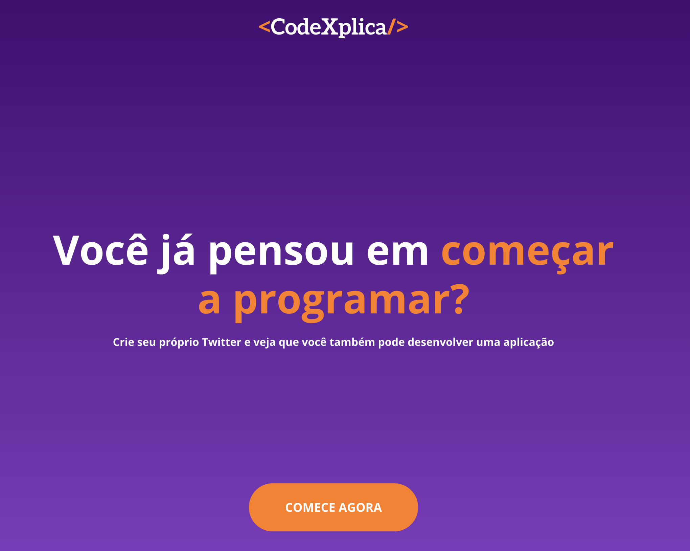

### Projeto do hackaton Rocketseat Experience

Esse projeto tem objetivo de ensinar os primeiros passos com código, principalmente para alunos do ensino médio que ainda não tiveram nenhum contato com a programação. Através desse projeto eles aprenderão algumas coisas básicas para começar a ter o gostinho do que é desenvolver sua própria e primeira aplicação web.

Participantes: @flpgst (Felipe Gonçalves), @patrickgmailhub (Patrick Guedes), @luccasxds (Luccas Fraga) e @jumaschion (Júlia Maschion)

### Url do projeto
[http://localhost:3000](http://codexplica.surge.sh/)

## Available Scripts

In the project directory, you can run:

### `yarn start`

Runs the app in the development mode. 
Open [http://localhost:3000](http://localhost:3000) to view it in the browser.

The page will reload if you make edits. 
You will also see any lint errors in the console.

